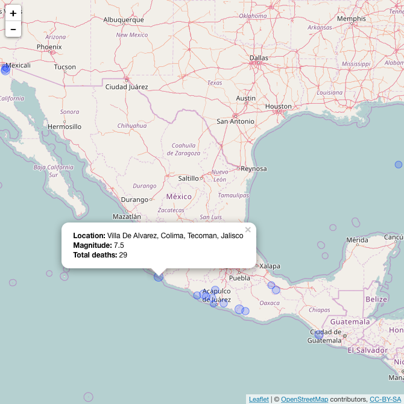

<!-- README.md is generated from README.Rmd. Please edit that file -->

```{r, echo = FALSE}
knitr::opts_chunk$set(
  collapse = TRUE,
  comment = "#>",
  fig.path = "README-"
)
```

[](https://travis-ci.org/davidbody/earthquakes-package)

# Earthquakes package

This is an R package for the Coursera course [Mastering Software Development in R Capstone](https://www.coursera.org/learn/r-capstone/home/welcome).

It consists of four components:

- Data from NOAA Significant Earthquakes Database
- Helper functions to clean the data
- Geoms for plotting earthquake time lines
- Functions for plotting interactive earthquake maps

Full documentation, including a vignette, and unit tests are included.

# Installation

```{r, eval=FALSE}
# install.packages("devtools")
devtools::install_github("davidbody/earthquakes-package")
```

## Usage

See the vignette for complete details.

### Earthquake data

```{r, message=FALSE}
library(earthquakes)
library(dplyr)

filename <- system.file("extdata", "earthquakes.tsv.gz", package = "earthquakes")
earthquakes <- readr::read_delim(filename, delim = "\t")

clean_earthquakes <- earthquakes %>%
    eq_clean_data()
```

### Earthquake time lines

```{r example-1, fig.width=7, fig.height=7}
library(ggplot2)

recent_earthquakes <- clean_earthquakes %>%
    filter(COUNTRY == "CANADA" | COUNTRY == "USA", YEAR >= 1980)

g <- ggplot(recent_earthquakes,
            aes(x = DATE, y = COUNTRY, size = EQ_PRIMARY, color = TOTAL_DEATHS))

g <- g + geom_timeline(alpha = 0.5)
g <- g + geom_timeline_label(aes(label = LOCATION_NAME, n_max = 3))
g <- g + theme_classic()
g <- g + theme(legend.position = "bottom",
               axis.line.y = element_blank(),
               axis.ticks.y = element_blank(),
               axis.title.y = element_blank())
g <- g + guides(color = guide_colorbar(title = "# deaths"),
                size = guide_legend("Richter scale value"))
g
```

### Earthquake maps

```{r example-2, eval=FALSE}
clean_earthquakes %>%
    filter(COUNTRY == "MEXICO" & lubridate::year(DATE) >= 2000) %>%
    dplyr::mutate(popup_text = eq_create_label(.)) %>%
    eq_map(annot_col = "popup_text")
```



This is a static image. The actual map will be interactive.
